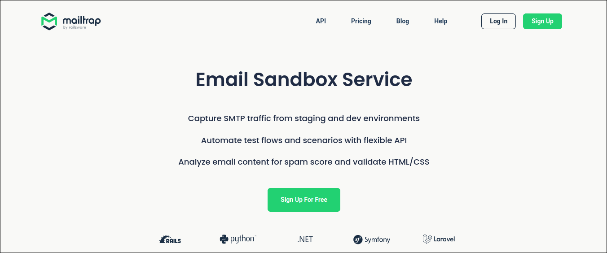

## DESENVOLVIMENTO DE SOFTWARE PARA A WEB 1
**Prof. Delano M. Beder (UFSCar)**

**Envio de *emails***

- - -

#### 01 - Envio de *emails* (Mailtrap)
[Código](https://github.com/delanobeder/DSW1/blob/master/SendMail/Mailtrap)
- - -

1. Faça o cadastro em  https://mailtrap.io/
   
   > *Mailtrap is a testing tool and is not designed to deliver emails to real addresses.*
   
   
   


2. Atualize o arquivo **src/main/resources/config.properties** com informações do cadastro (*username* e *password*)

   ```properties
   mail.smtp.host = smtp.mailtrap.io
   mail.smtp.port = 2525
   mail.smtp.auth = true
   username = <username>
   password = <password>
   ```
   
   

<div style="page-break-after: always"></div>


3. Abrir um terminal dentro da pasta do projeto e executar os seguintes comandos:

    ```sh
    % ./mvnw compile
    % ./mvnw exec:java
    ```
    
4. Verificar se duas mensagens foram enviadas e recebidas

    

    

5. Fim


#### Leituras adicionais

- - -
- Sending Emails with Java

  https://www.baeldung.com/java-email